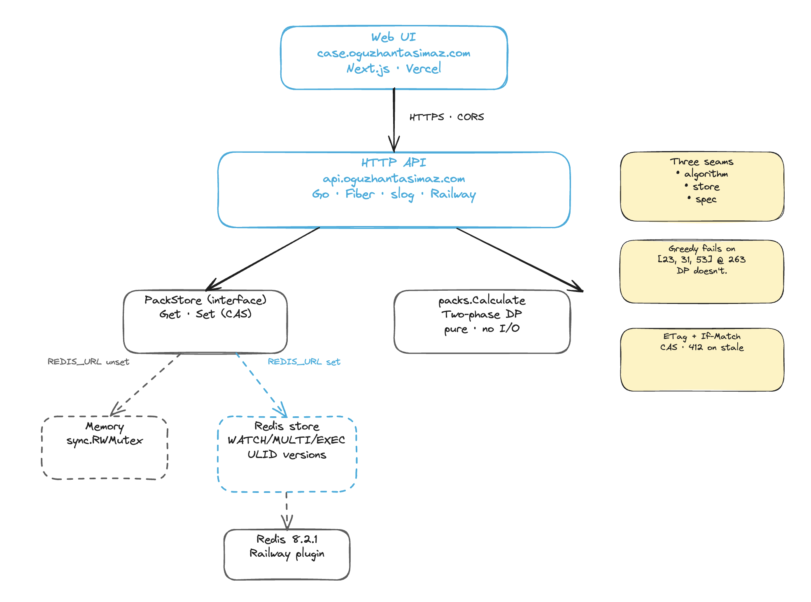
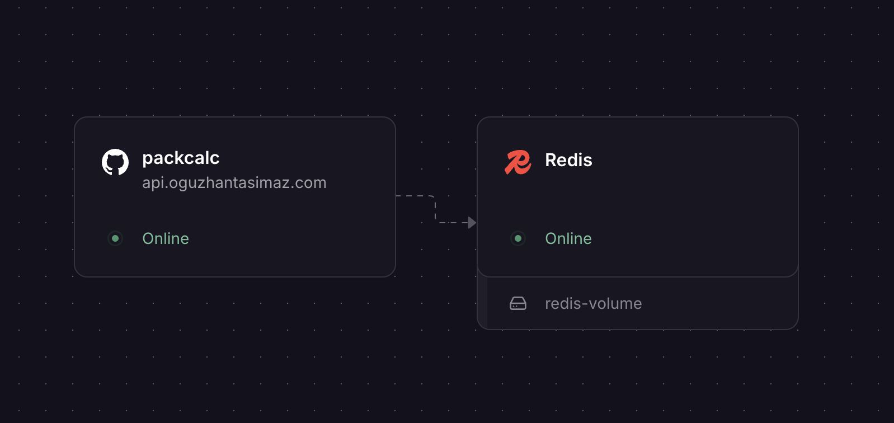

# packcalc

> Whole-pack shipment calculator — minimum items, then minimum packs. Pack sizes are runtime-configurable; no code change to add or remove a size.

---

## Why this problem is interesting and fun for me 

In Turkey, paying a bill of 173 TL is rarely a straightforward 200 TL transaction. Instead, a you will hand over 203 TL. The goal is precise: eliminate a handful of heavy coins and force the cashier to return a single, clean 30 TL note instead.

Our cashiers don't just accept this they expect it. Our brains instantly calculate these offsets to protect their own scarce supply of small change xD

When I try the same mental math in London, Bristol and Seoul and the most of the time system breaks. I'll likely get a confused stare, and the cashier will hand me extra coins back, insisting you made a mistake. They rely strictly on what the screen tells them.

This project is the same problem from the other side of the counter. The order is what the screen says; the shipment is what the cashier hands back. Both sides are picking from a fixed set of denominations and trying to land on the cleanest possible total. On adversarial pack sets, the "obvious" answer isn't just suboptimal it's wrong. That's why the algorithm here is two-phase DP, not greedy, and why pack sizes have to be runtime-configurable: the optimum depends entirely on what's in the till.

---

## Live demo

| | URL |
|---|---|
| GitHub | <https://github.com/oguzhantasimaz/packcalc> |
| Web UI | <https://case.oguzhantasimaz.com/> |
| HTTP API | <https://api.oguzhantasimaz.com/> |
| Swagger UI | <https://api.oguzhantasimaz.com/docs/> |
| OpenAPI 3.1 spec | <https://api.oguzhantasimaz.com/openapi.yaml> |
| Health / readiness | `/healthz` · `/readyz` |

The UI hits the API through a CORS-locked origin allowlist. The API is backed by a Railway-hosted Redis instance, seeded with the canonical pack sizes on first boot.

---

## The problem

Given an order quantity and a set of pack sizes, return the combination of whole packs that:

1. **Only whole packs** — packs cannot be broken open.
2. **Minimize total items shipped** — subject to (1), pick the smallest possible total ≥ order.
3. **Minimize the number of packs** — subject to (1) and (2). Rule 2 always wins over Rule 3.

Worked example with default sizes `[250, 500, 1000, 2000, 5000]`:

| order | correct result | items | packs |
|------:|----------------|------:|------:|
| 1 | `1 × 250` | 250 | 1 |
| 250 | `1 × 250` | 250 | 1 |
| 251 | `1 × 500` | 500 | 1 |
| 501 | `1 × 500 + 1 × 250` | 750 | 2 |
| 12 001 | `2 × 5000 + 1 × 2000 + 1 × 250` | 12 250 | 4 |

---

## The algorithm — two-phase DP

A naive greedy-by-largest-pack strategy is **wrong**. The classic counter-example is `sizes = [23, 31, 53]` at `order = 263`: greedy picks `5 × 53 = 265` (overshoot 2, 5 packs), but the optimum is `263` exactly — provably reachable with fewer packs. This is the "changing a dollar" problem, and the only correct general solution is dynamic programming.

`packs.Calculate(order, sizes)` runs in two phases:

**Phase A — minimum reachable total `T ≥ order`.** Build a reachability table over `[0 … order + maxSize − 1]` via unbounded knapsack: `reachable[i]` is true iff `i` is a non-negative integer combination of `sizes`. Scan upward from `order` — the first reachable index *is* `T`. The range is always sufficient because `maxSize` itself is reachable.

**Phase B — minimum packs for exactly `T`.** A second unbounded-knapsack table, `dp[i]` = minimum pack count to reach exactly `i`, with a parent-pointer table recording which size landed on `i`. Backtrack from `T` to reconstruct the multiset.

**Complexity.** Time `O((order + maxSize) · |sizes|)`, space `O(order + maxSize)`. Bench on Apple M1 Pro:

| case | ns/op | allocs |
|---|---:|---:|
| `Calculate(1_000_000, defaults)` | **9.5 ms** | 6 |
| `Calculate(12 001, defaults)` | 121 µs | 8 |
| `Calculate(500 001, [23, 31, 53])` | 6.4 ms | 8 |

Adversarial cases that ship as tests: `[23, 31, 53]@263`, `[23, 31, 53]@500 001`, `[6, 9, 15]@7`, `[6, 9, 15]@100`. All proven optimal against an independent reference implementation.

---

## Architecture



Three independently testable seams:

- **Algorithm** — `internal/packs/Calculate` is pure Go, no I/O. Drop in any pack set, get the optimal combination.
- **Store** — `internal/store.PackStore` interface, with in-memory and Redis implementations behind it. Selected at boot by `REDIS_URL` presence. CAS via `ETag` / `If-Match` so concurrent edits don't silently overwrite each other.
- **Spec** — `api/api/openapi.yaml` is hand-written and the single source of truth. `oapi-codegen` produces Go models (committed) so contract drift surfaces in code review.

```
api/
├── cmd/server/main.go              # wiring, graceful shutdown
├── internal/
│   ├── packs/                       # pure-Go two-phase DP + tests + bench
│   ├── store/                       # PackStore interface + memory + redis
│   ├── transport/
│   │   ├── http/                    # Fiber handlers, middleware, errors
│   │   └── types/                   # oapi-codegen output (committed)
│   ├── config/                      # env loader, single source for runtime cfg
│   └── logging/                     # slog: text in dev, JSON in prod
└── api/
    ├── openapi.yaml                 # hand-written spec (embedded at runtime)
    └── swagger-ui/                  # vendored 5.21, embedded at runtime
web/
├── app/                             # Next.js 15 App Router
├── components/                      # PackEditor, Calculator, ResultPanel,
│                                    # SharkScene (animated dot-grid + sharks)
└── lib/{api.ts, types.ts}           # typed client, zod schemas
```

---

## Run it locally

### Prerequisites

- Go 1.24+
- Node 20+ (for the UI)
- Docker (optional but recommended)

### Full stack — `docker compose` ✨

UI + API + Redis together. **One command, no toolchain installs required.**

```bash
docker compose up
```

→ <http://localhost:3000/> · UI · Next.js standalone
→ <http://localhost:8080/docs/> · API · Swagger UI
→ `redis://localhost:6379` · PackStore backend

The CAS / ETag flow uses the Redis store automatically. For the API on the in-memory store instead: `docker compose run --rm -e REDIS_URL= api`.


### API — bare Go

```bash
cd api
go run ./cmd/server
# → http://localhost:8080/healthz
```

Memory store by default. Set `REDIS_URL` to swap in the Redis backend.

### API — Docker

One line. No flags, no env, no volumes:

```bash
docker build -t packcalc ./api && docker run --rm -p 8080:8080 packcalc
```

→ <http://localhost:8080/docs/> for Swagger UI. The image is **distroless, non-root, statically linked, ~12 MB**. The OpenAPI spec and the Swagger UI dist are `go:embed`-ed into the binary, so there are no volume mounts or init containers.


### UI — Next.js dev server (with HMR)

For active UI work — the compose flow runs the production build, this one runs the dev server with hot-reload:

```bash
cd web
cp .env.local.example .env.local        # points at http://localhost:8080
npm install
npm run dev
# → http://localhost:3000
```

---

## API examples

Defaults are seeded on first boot. Status codes follow the OpenAPI spec verbatim.

```bash
# 1. Read current pack sizes (note the ETag header)
curl -i http://localhost:8080/api/v1/packs
# HTTP/1.1 200 OK
# Etag: 01KRGGR3QD9NBT3J08ZNS4QHEX
# {"sizes":[5000,2000,1000,500,250],"version":"01KRGGR3QD9NBT3J08ZNS4QHEX"}

# 2. Calculate
curl -X POST http://localhost:8080/api/v1/calculate \
  -H 'Content-Type: application/json' \
  -d '{"order":12001}'
# {"overshoot":249,"packs":[{"count":2,"size":5000},{"count":1,"size":2000},{"count":1,"size":250}],"total_items":12250,"total_packs":4}

# 3. Replace pack sizes (with optimistic concurrency)
ETAG=$(curl -sI http://localhost:8080/api/v1/packs | awk '/^etag:/{print $2}' | tr -d '\r')
curl -X PUT http://localhost:8080/api/v1/packs \
  -H 'Content-Type: application/json' \
  -H "If-Match: $ETAG" \
  -d '{"sizes":[100,500,1000,5000]}'

# 4. Stale If-Match → 412 version_mismatch
curl -X PUT http://localhost:8080/api/v1/packs \
  -H 'Content-Type: application/json' \
  -H 'If-Match: not-a-real-version' \
  -d '{"sizes":[10,20]}'
# 412 {"code":"version_mismatch","message":"version mismatch","request_id":"..."}

# 5. Validation error
curl -X POST http://localhost:8080/api/v1/calculate \
  -H 'Content-Type: application/json' \
  -d '{"order":-1}'
# 400 {"code":"invalid_request","message":"order must be >= 0: got -1","request_id":"..."}
```

Every response carries an `X-Request-Id` header (ULID if the caller didn't supply one). The same id appears in `ErrorResponse.request_id` and in every structured log line for that request, so failures are trivial to correlate.

---

## Environment variables

| Var | Default | Notes |
|---|---|---|
| `PORT` | `8080` | Listener port. Railway injects this automatically. |
| `ENV` | `dev` | `dev` → slog text handler. Anything else → JSON. |
| `LOG_LEVEL` | `info` | `debug` · `info` · `warn` · `error` |
| `REDIS_URL` | *(unset)* | Presence selects the Redis store; absence selects in-memory. |
| `CORS_ORIGINS` | `*` | Comma-separated origin allowlist. Locked down per-deploy. |
| `SHUTDOWN_TIMEOUT` | `30s` | Matches typical k8s `terminationGracePeriodSeconds`. |

`REDIS_URL` accepts the full URL form (`redis://[:password@]host:port/db`). On Railway this is wired via a service reference:

```
REDIS_URL = ${{Redis.REDIS_URL}}
```

---

## Tests

```bash
cd api
go test -race -count=1 ./...      # all packages, race detector on
go test -bench=. -benchmem -count=1 -run=^$ ./internal/packs
golangci-lint run --timeout=5m    # uses api/.golangci.yml
```

Layered coverage:

| layer | suite | what it proves |
|---|---|---|
| algorithm | `internal/packs` | Rules 1/2/3 hold on every reviewer + adversarial case; validation; bench |
| store | `internal/store` | Seed, normalize, version monotonicity, CAS hit/miss under 20-way contention (memory + miniredis) |
| HTTP | `internal/transport/http` | End-to-end via `app.Test`, every status code, ETag round-trip, request-id propagation, 404 envelope |

All suites run with `-race`. CI on GitHub Actions runs the same matrix plus `docker build` (which catches container regressions that a plain `go build` wouldn't).

---

## Deployment



### API → Railway

`api/railway.json` checked in. Service settings:

- **Root directory**: `api`
- **Builder**: Dockerfile (`api/Dockerfile`)
- **Healthcheck path**: `/healthz`
- **Restart policy**: on failure (5 retries)

Required environment variables on the Railway API service:

```
ENV               = production
LOG_LEVEL         = info
CORS_ORIGINS      = https://case.oguzhantasimaz.com,http://localhost:3000
REDIS_URL         = ${{Redis.REDIS_URL}}
```

Custom domain → `api.oguzhantasimaz.com` (CNAME to the Railway target). Cert is provisioned automatically by Railway within ~5 minutes of adding the domain.

### UI → Vercel

`web/vercel.json` pins the framework to Next.js. Root directory `web`, env:

```
NEXT_PUBLIC_API_URL = https://api.oguzhantasimaz.com
```

Custom domain → `case.oguzhantasimaz.com` (CNAME to `cname.vercel-dns.com`). Cert auto-provisioned.

### Verifying the deploy

```bash
URL=https://api.oguzhantasimaz.com
curl -sf $URL/healthz                # 200 {"status":"ok"}
curl -sf $URL/readyz                 # 200 {"status":"ready"} (proves Redis reachable)
curl -sf $URL/api/v1/packs           # 200 with ETag
curl -sf $URL/openapi.yaml | head -3
open $URL/docs/                      # browseable Swagger UI
```

---

## Production considerations (intentionally out of scope)

This is a case study; the bar is "thoughtfully omitted, not unaware". Things deliberately left out:

- **Auth on `PUT /api/v1/packs`** — currently anyone can replace the pack set. A real deployment would gate this behind mTLS / signed admin tokens / OIDC.
- **Rate limiting** — Fiber middleware or Cloudflare upstream.
- **OpenTelemetry tracing** — `otelfiber` + an OTLP exporter; spans on store calls and the calculator.
- **Error tracking** — Sentry or PostHog with stack-trace symbolication.
- **Audit logging** — who changed sizes when, with a diff. Probably a separate append-only log.
- **DI container** — `fx` / `dig`. Not worth the indirection at this size.
- **Prometheus / metrics** — request count + duration histograms, store ping latency, calculator complexity-vs-time.
- **Redis HA** — Sentinel or Cluster, TLS to Redis, password rotation.
- **k8s manifests** — Deployment, PDB, HPA, NetworkPolicy. The image is k8s-ready (12-factor, distroless, non-root, graceful shutdown, split liveness/readiness probes) but no manifests are committed.
- **Stricter input limits** — `MaxOrder`, `MaxPackSize`, and `MaxDistinctSz` are generous defaults; a real deployment would tune them per workload.
- **npm audit** — currently shows two moderate advisories against `postcss` bundled inside `next`. They're build-time only and not exploitable at runtime; the patched chain comes with Next 16+ which I'm pinning back from for stability.

---

## Tech choices and why

- **Go + Fiber.** Fiber's a fastHTTP-based router with idiomatic middleware. Sub-millisecond overhead, batteries-included CORS / recover / static-file middleware. Standard `net/http` is fine too — Fiber just trims boilerplate for handler-per-route layouts.
- **`log/slog`.** Standard library. Single logger value injected through the constructor chain — no `init()` side effects, no package-level globals. Text handler in dev, JSON in prod, toggled by `ENV`.
- **oapi-codegen, types-only.** The spec is hand-written; codegen produces request/response models. Server stubs intentionally not generated — handlers stay hand-written against Fiber's idioms but the wire types are derived. Drift surfaces immediately because `types.gen.go` is committed.
- **ULID for versions.** Sortable, unique, time-ordered. Inspecting the version stream in logs tells you the order of writes for free.
- **`alicebob/miniredis` for Redis tests.** Pure Go in-process Redis. Tests run under `-race` without needing a real Redis container.
- **Distroless `static-debian12:nonroot`.** ~2 MB base; the Go binary makes up the rest. Non-root UID, no shell, no package manager. Smallest viable attack surface.
- **`go:embed` for spec + Swagger UI.** No filesystem dependency at runtime. The image is a single self-contained artifact — no volume mounts, no init containers, the running container is fully portable.
- **Next.js App Router + zod.** Server-rendered shell, client components only where interactivity needs them. zod mirrors the API contract in `web/lib/types.ts` — contract drift surfaces as a clear validation error at the seam, not a downstream type confusion.
- **No Makefile.** Every "target" is a one-liner; the README shows the real commands. Reviewers and CI run the same commands the local dev runs.

---

## And one more thing

There's a small easter egg in the UI.
